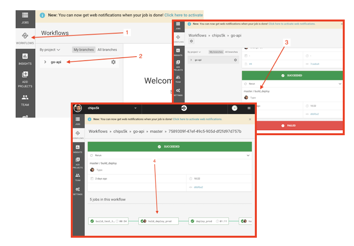

# Notes for reviewers

- main goal in this test was to show you that i can figure things out, learn quickly, and know some of the basics in relation to automation etc.. completely aware there is a tonne of stuff that can be improved, and a lot for me to learn.
- I've basically tried to mirror our workplace ideal setup, e.g buildkite + jupiter, in my case i didnt want to run up my own ecs, eks cluster and discovered i could do single node docker with elastic beanstalk on an ec2 instance. fully aware this isnt ideal for something in production
- a lot of things codewise can definitely be improved, given more time with learning GO i'd likely improve/modify everything.
- I've googled a lot, aws, docker, circleci, bash, golang etc...  to get this thing up and running and totally not ashamed of that.
- i do prefer to avoid abstracting things early, and would prefer to keep stuff really simple until i have good reasons to abstract it etc... 

# Things that could be improved

- As mentioned, tests, code etc.. could be improved with better language understanding. 
- Adding some form of smoke tests, or minimal e2e tests would be nice
- improve handling of logs - currently they vanish into a void. 
- Metrics/Monitoring bits and pieces
- quick/easy way to roll back environments/deployments
- automate dev environment deployments maybe
- precommit hooks, to run linter, tests (maybe)
- better handling of versioning artifacts
- Ditch elasticbeanstalk, circle ci, move to buildkite, eks style platdforms.
- codedoc? maybe

# Suggested test for reviewer to try:
 - checkout the code, and try the commands below (except the dockerhub, awseb stuff)
 - make a branch, commit and push a small change, open a pr and verify tests run
 - approve the pr, jump into circle ci and follow the jobs then manually approve the deployment.
 - the environments will be down, so doing the above should deploy the app, and if you check the output of the deploy job, you'll be able to grab the deployment url when its done.
 - Once you've checked it in a browser or api client, approve the teardown step to remove the environment and save me money.
 - ping me if you need to :)

Note - When looking in circleci, click the "Workflows" button to the left, then click the "master / build_deploy" job, from here you should be able to see the linked jobs, and click on the "hold_deploy_prod" step and provide approval. see below

# Developer setup
1. Ensure you have the following installed and configured:
    - Docker
    - Golang
    - eb-cli (optional) https://docs.aws.amazon.com/elasticbeanstalk/latest/dg/eb-cli3-install.html

2. (Optional) If you wish to perform dev eb deployments from your local machine:
   1. Request access to the `chips5k/go-api` dockerhub repository in order to push images (for dev purposes)
   2. Login to docker from the command line
   3. Either provide `AWS_ACCESS_KEY_ID` and `AWS_SECRET_ACCESS_KEY` as environment variables, or modify `.elasticbeanstalk/config.yml` to include a `profile: eb-cli` under the `global` section.
3. run `./dev-tasks.sh` to be presented with a list of available tasks
   1. **Local go commands**
      1. run `./dev-tasks.sh start` to build and run the app
      2. run `./dev-tasks.sh start-watch` to rebuild, rerun as files are changed
      3. run `./dev-tasks.sh test` to run the tests
   2. **Docker commands:**
      1. run `./dev-tasks.sh run-docker` to run the application inside docker
      2. run `./dev-tasks.sh test-docker` to run the app tests inside docker
   3. **Elasticbeanstalk commands**
      1. run `./dev-tasks.sh deploy-dev` to deploy to the dev eb env
      2. run `./dev-tasks.sh teardown-dev` to remove the dev environment

# CI/CD, Environments, Automation etc...

Current workflow/jobs/pipeline is setup as follows:
 - build/test will be performed against pull requests opened against master
 - build/test/tag/deploy will be performed on commits to master
 - The master workflow has two manual steps, one is approval to deploy to prod, the second is to tear the environment down.
 - IF no environment is present when running the deploy stage, elastic beanstalk commands will be called to bring it up.

So normal procedure for getting something into prod: open a pr against a branch, merge it, then login to circleci and go to the workflow, then approve the deploy stage.